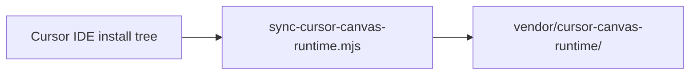
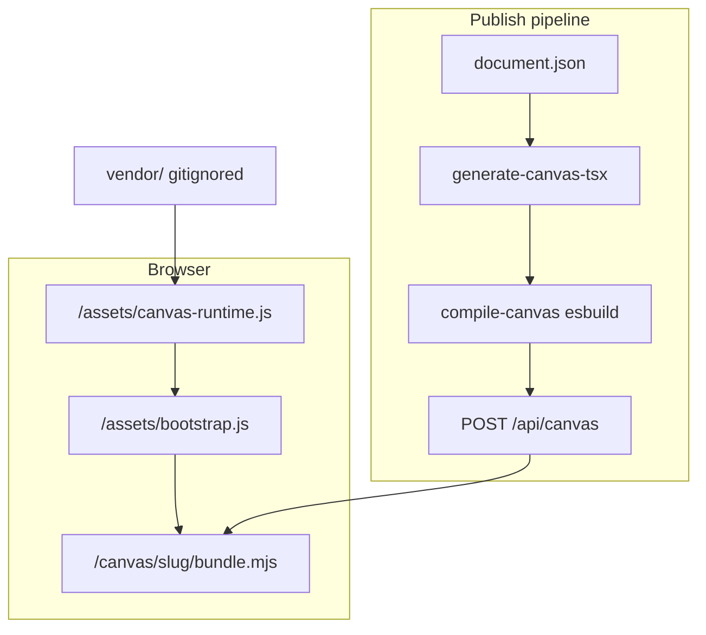

# cursor-canvas-runtime reference

OpenClaw（kusanali）における実装ファイル対応表。**プロプライエタリバイナリは skills リポジトリに含めない。**

## ファイル対応

| 役割 | OpenClaw パス |
|------|---------------|
| 同期スクリプト | `scripts/sync-cursor-canvas-runtime.mjs` |
| CLI 入口 | `oc canvas sync-runtime`（`scripts/cmd/canvas-publish.mjs`） |
| ドキュメント | `docs/KUSANALI-CANVAS-RUNTIME.md` |
| React shim | `services/kusanali-web/lib/canvas-react-shim.mjs` |
| JSX runtime shim | `services/kusanali-web/lib/canvas-jsx-runtime-shim.mjs` |
| esbuild コンパイル | `services/kusanali-web/lib/compile-canvas.mjs` |
| export 検証 | `services/kusanali-web/lib/introspect-runtime.mjs` |
| vendor 出力先 | `services/kusanali-web/vendor/cursor-canvas-runtime/` |

## 同期スクリプトの流れ



1. `CURSOR_RUNTIME_CANDIDATES` から `canvas-runtime.esm.js` を解決
2. `agent-sdk/cursor/canvas/*.d.ts` と `canvas-sdk-version` をコピー
3. 末尾 `export{CANVAS_PREVIEW_...,mountCanvas,...}` を 51 シンボル付きに置換
4. `exports.json` を生成

## esbuild external プラグイン（抜粋）

`compile-canvas.mjs` の `createCanvasExternalsPlugin`:

- `cursor/canvas` → `CANVAS_RUNTIME_ASSET_URL`（`/assets/canvas-runtime.js`）
- `react` → `CANVAS_REACT_SHIM_URL`
- `react/jsx-runtime` → `CANVAS_JSX_RUNTIME_SHIM_URL`

ユーザーコードは `import { Card, Text } from 'cursor/canvas'` のままバンドルされ、ランタイム本体は external としてブラウザが別 GET する。

## React shim（抜粋）

`canvas-react-shim.mjs`:

```javascript
const React = globalThis.React;
if (!React) {
  throw new Error("canvas-react-shim: globalThis.React is not set (load canvas-runtime first)");
}
export default React;
```

`mountCanvas`（ランタイム側）が先に読み込まれ、`globalThis.React` が存在する状態で `bundle.mjs` が評価される。

## バージョンピン

`canvas-sdk-version` は Cursor IDE ビルドに紐づくハッシュ。同期ログ例:

```
Synced canvas-runtime → .../vendor/cursor-canvas-runtime
canvas-sdk-version: <hash>
Re-exported 51 cursor/canvas symbols
```

IDE アップデート後は必ず再同期し、ハッシュ変化と export パッチ適用可否を確認する。

## アーキテクチャ（Rehost）



## 横比較テスト

1. IDE で `.canvas.tsx` を横パネル表示
2. `oc canvas publish --sample-v2` で Web 公開
3. `https://kusanali.lll.fish/canvas/...` とレイアウト・テーマを目視比較

## 関連

- 汎用フレーム: [runtime-vendor/SKILL.md](../runtime-vendor/SKILL.md)
- テンプレート: [runtime-vendor/templates/](../runtime-vendor/templates/)
