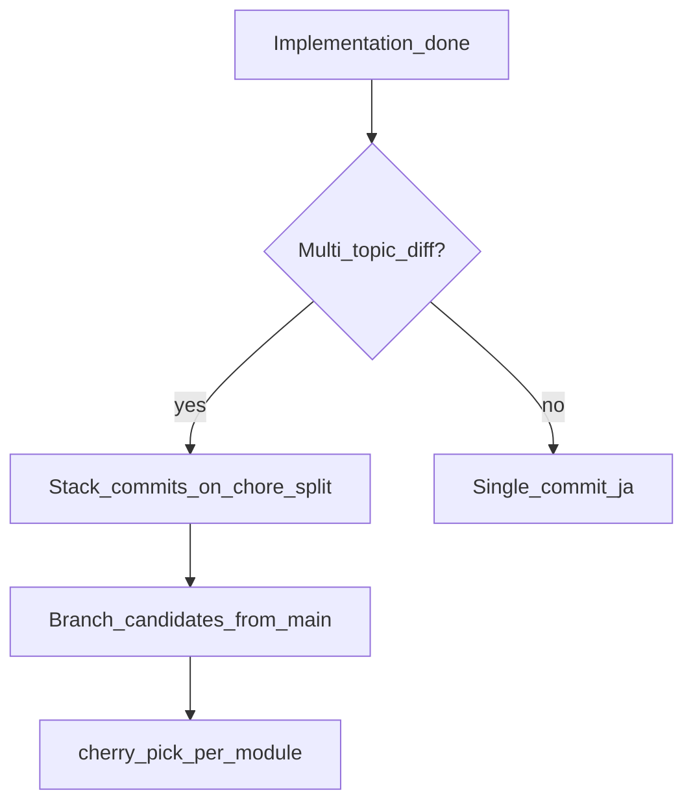
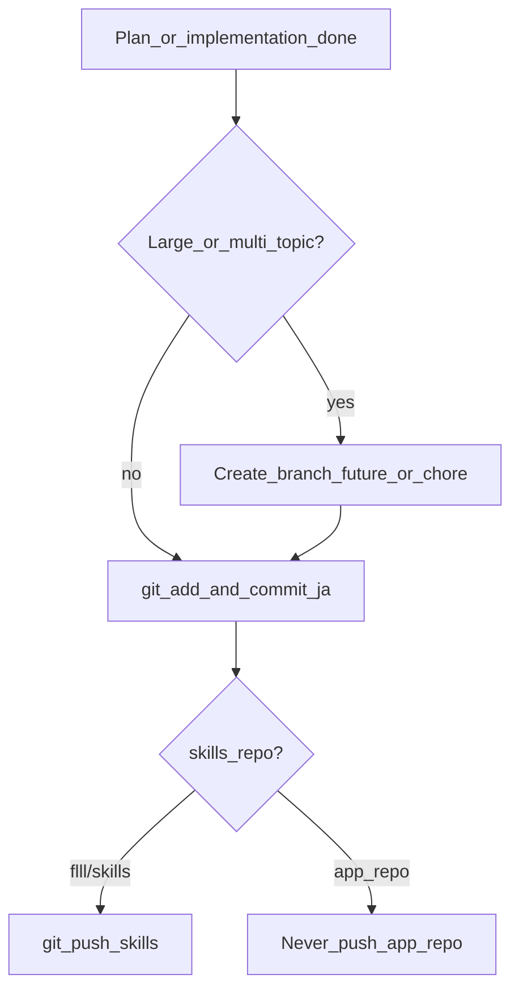

# cursor-workflow reference

## プラン用絵文字（コピペ用）

```
🎯 目的
🔧 手順 / 実装
⚠️ 注意・リスク
✅ 完了条件・テスト
📁 変更ファイル
📌 前提・依存
🚫 やらないこと
📋 チェックリスト
```

## Skills 自動読込 vs スラッシュ

| 方式 | 説明 |
|------|------|
| 自動 | エージェントが `description` とタスクを照合し、関連 Skill の `SKILL.md` を読む |
| 手動 | `/cursor-workflow` や `@cursor-workflow`（任意） |

起動時に全 Skill の **全文** が毎回入るわけではない（name + description が索引）。

## モジュール化コミット（cherry-pick）



| コミット種別 | 例 |
|--------------|-----|
| chore | gitignore、誤コミット防止 |
| fix / refactor | バグ・基盤（依存が先） |
| feat | 機能 |
| config / docs | 設定・文書 |

ブランチ例: `fix/win32-spawn-hide-shared`, `feat/discord-admin-thread-auth`, `chore/split-jun-2026`（全積み上げ）

## ブランチ判断フロー



## コミットメッセージ（日本語・例）

```
Tailscale サイドカー用 compose を追加し、ホスト公開ポートを外した。

GSM から secret を読むスクリプトを追加した。

cursor-workflow に日本語コミットと skills 専用 push 方針を追記した。
```

英語メッセージは使わない（リポジトリの既存言語が英語のみのときはそのリポジトリの慣習に合わせてよいが、**ユーザー未指定時は日本語**）。

## push ポリシー（厳守）

| 対象 | エージェントが push してよいか |
|------|-------------------------------|
| **flll/skills** のみ | **はい** — 編集後は能動的に `git push` + `sync-skills.sh` |
| アプリ・OpenClaw・その他すべて | **いいえ** — ユーザーがそのターンで「push して」と言うまで |
| ユーザーが push を明示 | その指示に限り実行可 |

**なぜ skills 以外は push 禁止か**: ユーザーは `git commit --amend` や rebase で履歴を整えてから、自分のタイミングで push する。エージェントの先回り push はリモートとローカルのずれ・force の誘発・不具合の的になる。

**エージェントがやってはいけない例**: 実装完了のお礼 push、CI 用の先回り push、`gh pr create` のための無断 push。

## コミット手順

```bash
git status
git diff
git log -1 --format='%s'

git add <relevant-files>
git commit -m "$(cat <<'EOF'
変更の理由を日本語で1〜2文。

EOF
)"
git status
```

## Skills 同期（flll/skills のみ push 可）

```bash
~/.cursor/skills-repo/scripts/sync-skills.sh
~/.cursor/skills-repo/scripts/verify-skills.sh
cd ~/.cursor/skills-repo && git push
```
