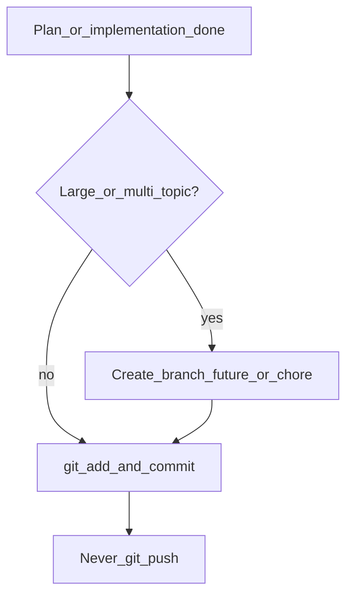

# cursor-workflow reference

## プラン用絵文字（コピペ用）

```
🎯 目的
🔧 手順 / 実装
⚠️ 注意・リスク
✅ 完了条件・テスト
📁 変更ファイル
📌 前提・依存
🚫 やらないこと
📋 チェックリスト
```

## ブランチ判断フロー



### 小さい変更の目安

- 1 つのバグ修正・文言修正・設定 1 箇所
- 変更ファイルがおおよそ 5 以下で同一トピック
- レビュー単位として main に直接載せて問題ない

### 大きい変更の目安

- 新機能・複数モジュールにまたがるリファクタ
- 後で PR にまとめたい・実験的で取り消しやすくしたい
- 複数コミットに分ける予定がある

## コミットメッセージ例（文面）

```
Tailscale サイドカー用 compose を追加し、ホスト公開ポートを外した。

GSM から secret を読む load スクリプトを追加し、OneDrive 同期を主経路から外した。

infra-secrets の reference に Cloudflare User Token の使い分けを追記した。
```

## push ポリシー

| 状況 | push |
|------|------|
| プラン遂行・実装完了後（デフォルト） | **しない** |
| ユーザーが「push して」と明示 | する |
| flll/skills 自体のメンテ（ユーザーが skills 更新を依頼） | ユーザーの指示に従う |

作業対象がアプリリポジトリのとき、エージェントは **commit まで** で止める。

## コミット手順（再掲）

```bash
git status
git diff
git log -1 --format='%s'

git add <relevant-files>
git commit -m "$(cat <<'EOF'
Why-focused message in 1-2 sentences.

EOF
)"
git status
```
