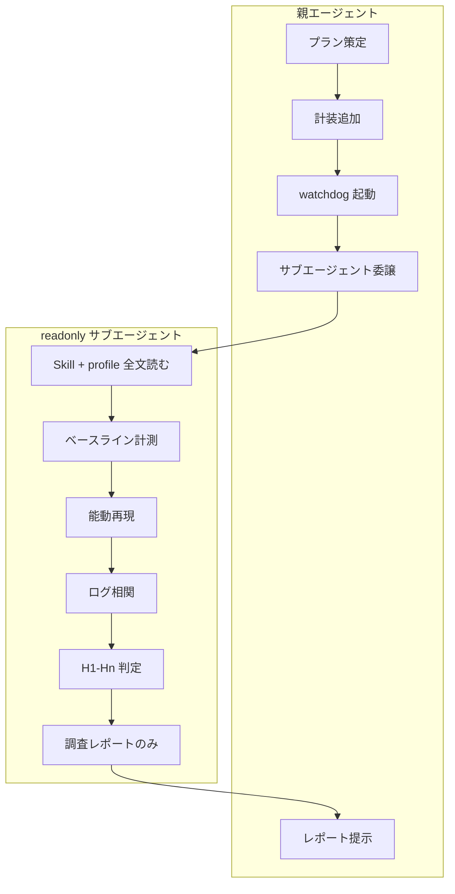

# debug-hunt reference

## アーキテクチャ



## プロファイル仕様（`profile.md`）

ドメイン Skill の `profile.md` に含める項目:

| セクション | 内容 |
|------------|------|
| 症状・トリガー | いつ発生するか |
| 仮説表 | ID・内容・検証方法 |
| 再現シナリオ | 代替経路（HTTP / CLI / 内部 API） |
| 計装 | 環境変数・ログパス |
| watchdog | JSON プロファイルへの参照 |
| 閾値 | ALERT / ABORT の意味 |

雛形: [templates/profile.template.md](templates/profile.template.md)

## watchdog プロファイル JSON

`resource-watchdog.mjs --profile <path>` で読み込む。

```json
{
  "name": "example",
  "intervalMs": 5000,
  "logPath": "~/.openclaw/logs/watchdog.ndjson",
  "logPathEnv": "OC_WATCHDOG_PATH",
  "baselineCapture": true,
  "measure": {
    "type": "powershell",
    "script": "$names = @('node'); ..."
  },
  "metrics": [
    {
      "name": "node",
      "alert": {
        "absolute": 25,
        "delta": { "windowMs": 30000, "threshold": 10 }
      },
      "abort": {
        "absolute": 40
      }
    },
    {
      "name": "conhost",
      "alert": {
        "delta": { "windowMs": 10000, "threshold": 3 }
      },
      "abort": {
        "baselineDelta": 6
      }
    }
  ],
  "abortActions": [
    {
      "type": "spawn",
      "command": "node",
      "args": ["~/.openclaw/scripts/oc.mjs", "kill"],
      "detached": true
    }
  ],
  "sampleOnAlert": {
    "type": "powershell",
    "script": "Get-CimInstance Win32_Process ..."
  }
}
```

### 閾値モード

| キー | 意味 |
|------|------|
| `absolute` | 計測値が閾値以上で発火 |
| `delta` | 過去 `windowMs` 内の増分が `threshold` 以上で発火 |
| `baselineDelta` | 起動時 baseline からの増分が閾値以上で発火（**dev PC 誤爆防止のデフォルト推奨**） |

**設計原則**: 絶対閾値のみの ABORT は dev PC で誤爆しやすい。`baselineDelta` を優先する。

### 環境変数

| 変数 | 効果 |
|------|------|
| `DEBUG_HUNT_ROOT` | ログのルート（既定 `~/.openclaw`） |
| プロファイルの `logPathEnv` | ログパス上書き用 env 名 |

## 調査レポート形式

サブエージェントは以下を返す（fix 実装は含めない）:

1. **再現手順と成否** — 実行したコマンドと結果
2. **仮説判定表** — 各 ID を CONFIRMED / REJECTED / INCONCLUSIVE
3. **根本原因** — 優先度付き 1–3 件 + 証拠ログパス
4. **次フェーズ fix 案** — 実装はしない

## 安全装置設計

- watchdog は親が `run_in_background` で起動し、再現中ずっと監視
- ABORT 発火時: プロファイルの `abortActions` を実行し、NDJSON に記録
- サブエージェントは ABORT 検知後に再現を中断し、レポートに記録
- 調査フェーズでの `fix:` コミット・ユーザーへの本番操作依頼は禁止

## 再帰ループ（最大 5 ラウンド）

```
仮説立案 → 計装追加 → watchdog 起動 → サブエージェント再現
  → ログ相関 → 仮説更新 → （未解決なら繰り返し）
```

各ラウンドで新しい証拠を得られない場合は打ち切り、INCONCLUSIVE を明示する。

## 新ドメイン追加手順

1. `templates/profile.template.md` をコピー
2. `<domain>-hunt/profile.md` に仮説・再現・閾値を記入
3. 必要なら watchdog JSON と reproduce スクリプトを追加
4. `SKILL.md` description にトリガー語を書く
5. プランは CreatePlan + debug-hunt 親手順に従う
