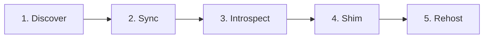

# runtime-vendor — 不透明ランタイムのベンダリング

ホスト製品（IDE / Electron / JAR 等）に同梱された **不透明ランタイム** を、逆コンパイルや UI 再実装ではなく **Extract-and-rehost** で取り込み、**ランタイムパリティ** を保ったまま自プロジェクトで配信する汎用フレームワーク。

ドメイン固有のパス・シンボル・ビルド手順は各プロファイル Skill（例: [cursor-canvas-runtime](../cursor-canvas-runtime/SKILL.md)）の `profile.md` に置く。

## 🎯 必須原則

| 原則 | 内容 |
|------|------|
| Extract-and-rehost | ホストのビルド済みアーティファクトを抽出し、自ホスト環境へ載せ替える |
| ランタイムパリティ | 見た目・API・挙動はホスト実装に寄せる。独自 UI へ黙ってフォールバックしない |
| vendor は gitignore | プロプライエタリバイナリは **リポジトリにコミットしない** |
| Host shim は薄く | テーマ注入・グローバル橋渡し・esbuild external 解決のみ |
| バージョンピン | `*-sdk-version` 等のハッシュで IDE / JAR 版を固定し、更新後に再同期 |

詳細・法的チェックリスト: [reference.md](reference.md)

## 📌 5 層アーキテクチャ

### 1️⃣ Discover — アーティファクト抽出の探索

ホストのインストールツリーからランタイムの実体パスを特定する。

- Windows: `%LOCALAPPDATA%\Programs\<product>\...`
- macOS: `/Applications/<Product>.app/Contents/...`
- Linux: `~/.local/share/...` またはパッケージマネージャ経路
- 環境変数オーバーライド（例: `CURSOR_CANVAS_RUNTIME_PATH`）を必ず用意
- 候補パスを配列で列挙し、最初に存在するものを採用

### 2️⃣ Sync — ベンダー同期

`vendor/<host-runtime>/` へコピー（**gitignore 必須**）。

- 同期スクリプトは `scripts/sync-<host>-runtime.mjs` 等に置く
- 必要ならパッチ（re-export 拡張など）を同期時に適用
- `canvas-sdk-version` 相当のピンファイルを同梱コピー
- 同期失敗時は **ビルド停止**（独自再実装へ黙って逃げない）

雛形: [templates/sync-script.template.mjs](templates/sync-script.template.mjs)

### 3️⃣ Introspect — export 一覧と型整合

ランタイムが実際に公開するシンボルと型定義を揃える。

- `exports.json` — 再エクスポート名・`patchedAt` を記録
- ホスト同梱 `.d.ts` を `vendor/.../types/` へコピー
- ビルド前に `verifyRuntimeExports()` で欠落を検出

雛形: [templates/exports-introspect.template.mjs](templates/exports-introspect.template.mjs)

### 4️⃣ Shim — Host shim（薄いアダプタ）

ホストが提供していたグローバル・テーマ・モジュール解決を代替する。

- `globalThis.React` 橋渡し（ランタイムが React を内包する場合）
- `prefers-color-scheme` → ホストテーマ API への注入
- esbuild `onResolve` で `cursor/canvas` 等を external URL へ

雛形: [templates/host-shim.template.ts](templates/host-shim.template.ts)

### 5️⃣ Rehost — ビルド・配信

npm publish ではなく、自 Worker / CDN / 静的アセット経由でブラウザまたは Node に載せる。

- esbuild / Vite でユーザーコードをバンドル
- ランタイム本体は `/assets/<runtime>.js` として別配信
- JAR の場合は unpack 先を classpath または esbuild alias で参照

## ⚠️ 禁止事項

| 禁止 | 理由 |
|------|------|
| vendor/ を git commit | ライセンス違反・リポジトリ肥大化 |
| 同期失敗時の独自 UI フォールバック | ランタイムパリティ喪失・デバッグ不能 |
| 逆コンパイル前提 | 難読化・難易度・法的リスク |
| Host shim にビジネスロジック | 差分が膨らみ、ホスト更新で破綻 |
| npm にプロプライエタリを publish | 再配布条件違反の典型 |

## 🔧 エージェント手順

1. **プロファイル確認** — 対象ドメイン Skill の `profile.md` を全文読む
2. **Discover** — インストールツリーまたは環境変数でアーティファクトパスを確定
3. **Sync スクリプト実行** — vendor 生成、バージョンピンをログ出力
4. **Introspect 検証** — `exports.json` と実モジュールの一致を確認
5. **Shim 実装** — テンプレートをコピーし、external 解決のみ追加
6. **Rehost ビルド** — esbuild/Vite/Assets パイプラインを接続
7. **横比較テスト** — ホスト IDE と自配信 URL で同一データを並べて確認

## 📁 新ドメインプロファイル追加

1. `runtime-vendor/templates/` から sync / shim / introspect 雛形をコピー
2. `<domain>-runtime/profile.md` にパス・シンボル数・コマンドを記入
3. `<domain>-runtime/SKILL.md` の description にトリガー語を書く
4. アプリリポジトリの `.gitignore` に `vendor/<host-runtime>/` を追加
5. README（flll/skills）の Skills 表に行を追加

プロジェクト固有の同期スクリプト・ビルドは **アプリリポジトリ**、手順・用語・禁止事項は **flll/skills** に置く。

## ✅ 完了条件

- [ ] vendor はローカル生成のみ（git に含まれない）
- [ ] 同期コマンドが CI / ローカルビルドの前提として文書化されている
- [ ] export 検証が同期後またはビルド前に走る
- [ ] ホスト更新後の再同期手順（バージョンピン確認）が書かれている
- [ ] 独自 UI へのフォールバックがコード・ドキュメントのどちらにも無い
