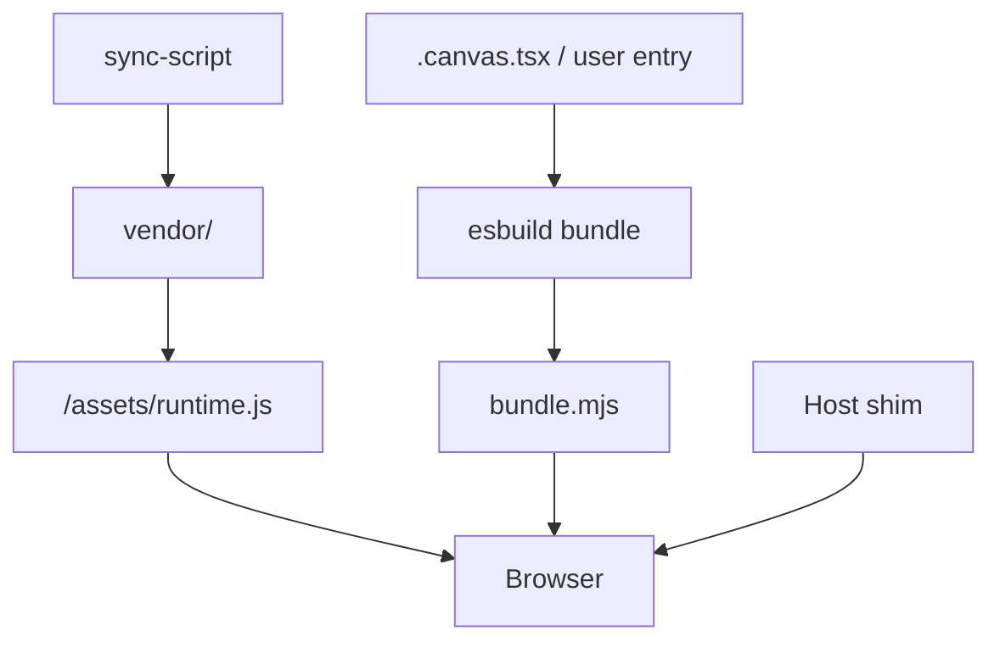

# runtime-vendor reference

## 用語

| 用語 | 意味 |
|------|------|
| 不透明ランタイムのベンダリング | ソース非公開のビルド済み JS/WASM/JAR をホストから抽出し vendor に置くこと |
| アーティファクト抽出 | インストールツリーから `.js` / `.asar` / `.jar` 等の実体を見つける Discover 段階 |
| Extract-and-rehost | 抽出 → vendor 同期 → Host shim → 自インフラ配信の一連パターン |
| ランタイムパリティ | API・見た目・挙動をホスト実装と一致させること |
| Host shim | ホストが担っていたテーマ・グローバル・モジュール解決の薄い代替層 |

## 法的・運用チェックリスト

| 項目 | 方針 |
|------|------|
| ライセンス | ホスト EULA / プロプライエタリ条項を確認。不明なら法務または利用規約を読む |
| git | `vendor/`・抽出バイナリ・`.asar` 展開物は **コミット禁止** |
| 再配布 | 自サービスのブラウザ配信・社内ビルドに限定。公開 npm / 第三者へのバイナリ配布は原則禁止 |
| 帰属 | 同梱 `*.LICENSE.txt` があれば vendor にコピーし、配信時の義務を確認 |
| 更新 | ホスト製品アップデート後はバージョンピンを再確認し、パッチ適用可否を検証 |
| 同期失敗 | ビルドを止める。独自再実装へ黙ってフォールバックしない |

## アンチパターン

| アンチパターン | なぜダメか | 正しい代替 |
|----------------|------------|------------|
| vendor を git に入れる | ライセンス違反・diff 肥大 | `.gitignore` + 同期スクリプト |
| 同期失敗でスタブ UI | パリティ喪失・本番だけ壊れる | `throw` / ビルド失敗 |
| 逆コンパイル前提 | 時間・品質・法的リスク | Extract-and-rehost |
| Shim にドメインロジック | ホスト更新で破綻 | アプリ側にビジネスロジック |
| 型だけ手書きで実装と乖離 | 実行時 `undefined` | ホスト `.d.ts` をコピー + introspect |
| 全シンボルを再実装 | メンテ不能 | 必要 export のみ re-export パッチ |

## Electron / asar ノート

- ランタイムは `resources/app.asar` 内の `extensions/<id>/dist/` にあることが多い
- 開発時は `asar extract` または IDE が展開した `resources/app/` ツリーを直接参照
- パスは Cursor 版アップデートで変わる — **候補配列 + 環境変数** で吸収
- `canvas-runtime.esm.js` のような単一 ESM は asar 外の `dist/` に置かれる例もある（Discover で両方試す）

## JAR / JVM ノート

- `jar tf app.jar` でクラスパスを列挙し、必要な `.class` / リソースだけ unpack
- vendor 先は `vendor/<artifact>/classes/` 等、gitignore 必須
- Node から使う場合は `esbuild` の alias または JNI ブリッジで classpath を解決
- 難読化・署名付き JAR は逆コンパイルではなく **そのまま classpath に載せる** 方針を優先

## vendor ディレクトリ構成（推奨）

```
vendor/<host-runtime>/
  <runtime>.esm.js          # 本体（gitignore）
  <sdk>-version               # ピンハッシュ（gitignore）
  exports.json                # introspect 生成（gitignore 推奨）
  types/                      # ホスト .d.ts コピー（gitignore）
  *.LICENSE.txt               # あれば同梱（gitignore）
```

## 同期スクリプトの責務

1. 候補パスを走査（環境変数優先）
2. 型定義・バージョンピンをコピー
3. 必要なら ESM の `export{...}` 行をパッチ（re-export 拡張）
4. `exports.json` を書き出し
5. 成功ログにバージョンとシンボル数を出す

## Rehost パイプライン（ブラウザ例）



## 検証コマンド（汎用）

```bash
# 同期
node scripts/sync-<host>-runtime.mjs

# export 検証（アプリ側 introspect モジュール）
node -e "import('./lib/introspect-runtime.mjs').then(m => m.verifyRuntimeExports([...]))"

# ビルド（vendor 前提）
npm run build
```

## 関連 Skill

- ドメインプロファイル例: [cursor-canvas-runtime](../cursor-canvas-runtime/SKILL.md)
- Git / push ポリシー: [cursor-workflow](../cursor-workflow/SKILL.md)
